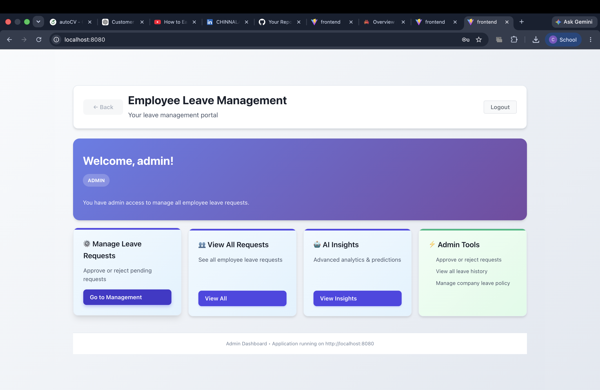
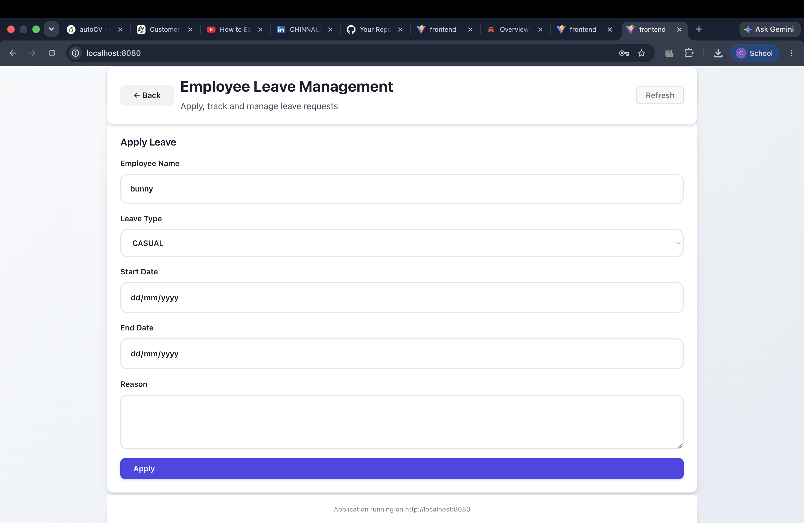

# AI-Based Employee Leave Management System

## Overview

A role-based leave management system developed using Spring Boot, Java, and MySQL to streamline leave requests, approvals, and tracking.

## Features

* Employee leave application
* Manager leave approval workflow
* Role-based access control
* REST API integration
* Database management using MySQL

## Tech Stack

* Java
* Spring Boot
* MySQL
* REST APIs
* Git

## Screenshots

## Screenshots

### Login Page

### Dashboard

### Leave Request Form

## Author

Chinnala Manasa
